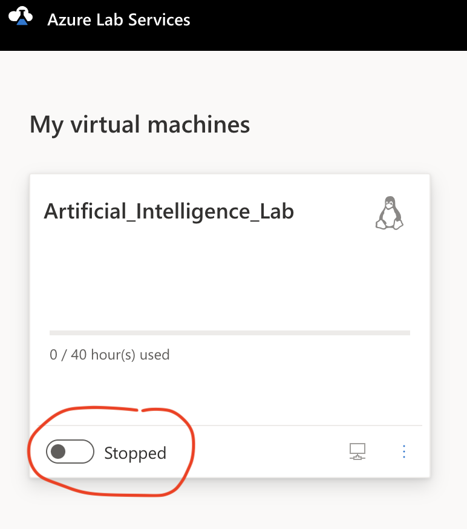
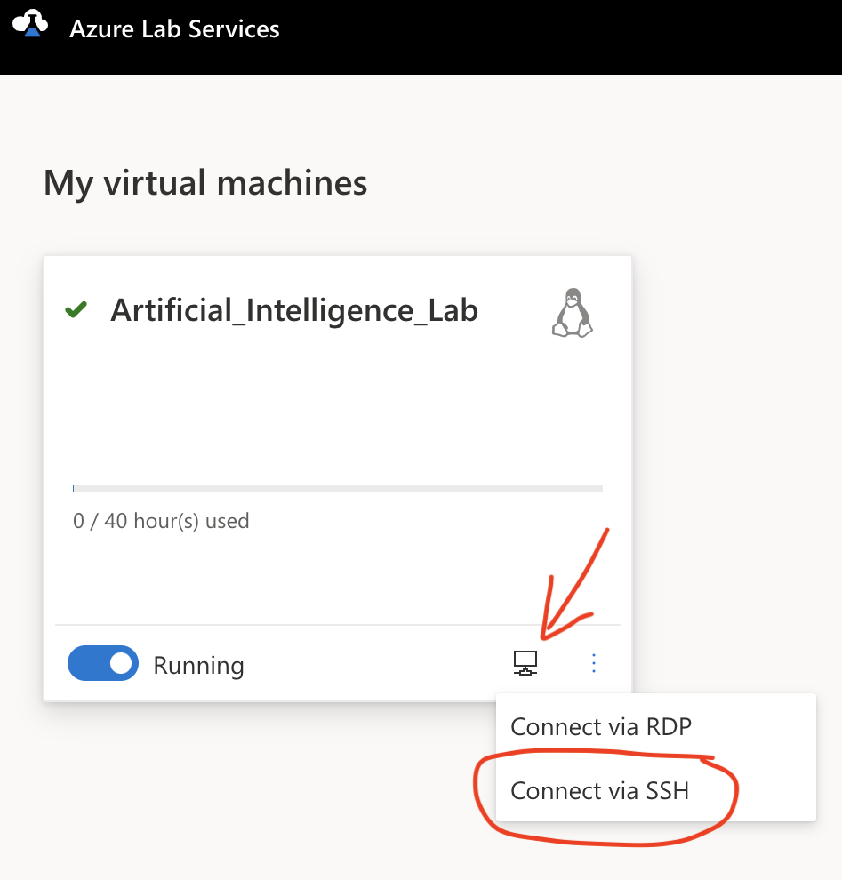
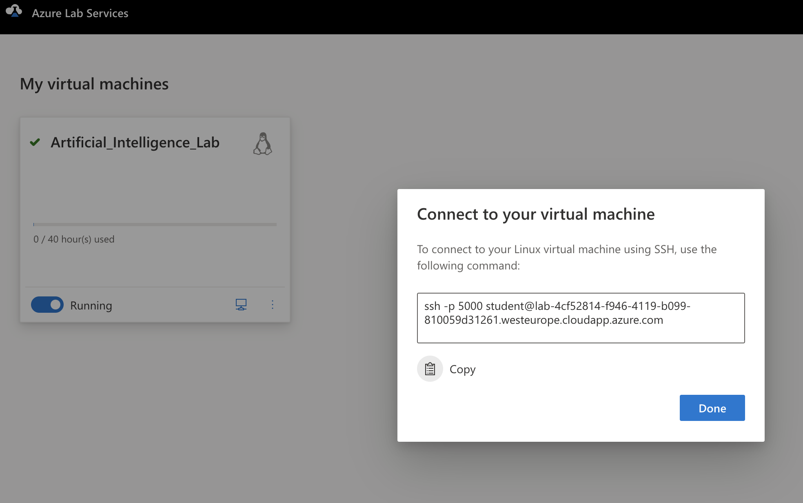

# AI course software setup

This document describes the setup of Linux virtual machines for the AI course. The recommended way of running the experiments for the assignments is by means of Azure Labs, but if you prefer to run (also) on your computer we suggest to use [Multipass](https://multipass.run/) virtualisation software.


## Software on your Computer

Accessing the virtual machine for the lab requires the use of `ssh` and the setup of a key (a SSH key is also recommended to use the [GitLab server](https://gitlab.inf.unibz.it/)). To check whether you already have a key, and to create a new one if needed, you can refer to the [GitHub](https://docs.github.com/en/authentication/connecting-to-github-with-ssh/generating-a-new-ssh-key-and-adding-it-to-the-ssh-agent) or [GitLab](https://gitlab.inf.unibz.it/help/user/ssh.md) documentation.

Several development IDEs support remote development via `ssh`; e.g., [Visual Studio](https://code.visualstudio.com/docs/remote/remote-overview) and [JetBrains IDEs](https://www.jetbrains.com/remote-development/).

## Software on the Virtual Machine

The setup is based on a Linux machine configured with the following package managers:

- [Miniforge](https://github.com/conda-forge/miniforge), an alternative to [Miniconda](https://docs.conda.io/en/latest/miniconda.html), including the more efficient [Mamba](https://mamba.readthedocs.io/en/latest/) engine.
- [Nix package manager](https://zero-to-nix.com/).

The script [setup.sh](setup.sh) installs the above software within a Linux distribution (the only dependency is `curl`). It *must* be run as a regular user (not root) with `sudo` access for privileged operations (to verify whether the unprivileged user you're using can use `sudo` you can use the command `sudo ls /`). The script can be used to setup a Linux system of your choice (virtualised or not), e.g. with [Windows Subsystem for Linux](https://learn.microsoft.com/en-us/windows/wsl/about), [Apptainer](https://apptainer.org/), or Docker/Podman. Even if you're using a Linux machine as your main computer, it's better to isolate the setup for the lab using virtualisation with Multipass, Apptainer or Podman.

For the course you can use a pre-configured virtual server on [Azure Lab Services](https://labs.azure.com/) or set-up a virtual server on your computer. For this last option we suggest to use [Ubuntu Multipass](https://multipass.run/). Below you'll find more details.

### Using Azure Labs Services

A virtual machine template with the required software is available for the course on [Azure Lab Services](https://labs.azure.com), to use the services you need to authenticate using the unibz account. Each student will receive an email with a link for registering to the *Artificial_Intelligence_73054* lab. After the registration the VM will appear among the ones available to the account ([direct link](https://labs.azure.com/virtualmachines)).

To use the VM, first it needs to be booted up using the slider on the left bottom corner:



Once running the VM should be accessed using SSH, with the default username `labuser`. *Do not change the username on the VM*, otherwise the software might not work correctly. Information on the VM internet address and connection port are available by clicking on the small computer icon on the bottom right:





Note that the VM is configured to use a non-standard SSH port, so the `-p` option must be used accordingly (in the screenshot example above is 5000, but it could be different). Bear that in mind if you're not using the command line to connect to the VM. From the Azure documentation is not clear whether the IP address and the port could change after a restart of the VM, so is safer to assume that they might change.

You received the default password via email, you can change it once connected using the [passwd](https://tldr.inbrowser.app/pages/common/passwd) command. However, the most convenient method to access the VM is to configure the SSH key based authentication. To do so you need to create a key pair on your laptop (using `ssh-keygen` command) and copy the public key on the VM (using the [`ssh-copy-id`](https://tldr.inbrowser.app/pages/common/ssh-copy-id) command), more details on [What is ssh-keygen & How to Use It to Generate a New SSH Key?](https://www.ssh.com/academy/ssh/keygen). Detailed instructions are available on [Visual Studio Code documentation](https://code.visualstudio.com/docs/remote/troubleshooting#_configuring-key-based-authentication). This would also simplify remote development using IDEs that support it; e.g. [Visual Studio Code](https://code.visualstudio.com/docs/remote/remote-overview) or [JetBrains](https://www.jetbrains.com/remote-development/).

Beware that VM might reset to default state, and in that case your files will be lost! This will happen only on rare cases, but you must ensure that your work is securely pushed on the git remote repository every time you disconnect from the VM. BTW, the same applies to your laptop as well, since hardware might fail without warnings!

### Using Multipass

If you're planning to run the labs on your computer, *Multipass* is the recommended way of installing the required software. See the [documentation](https://multipass.run/install) for instructions on how to install Multipass, and get you started with it.

The default memory and disk size is rather limited (1G and 4G), so you'll need to specify more resources. It depends on the resources you have on the running host, but you'll need at least 2 to 4 GB of memory and 20 GB of disk space, and you might want to provide more than one CPU. Look at [documentation](https://multipass.run/docs/create-an-instance#heading--create-an-instance-with-custom-cpu-number-disk-and-ram) for details.

The [Cloud-init](https://cloud-init.io/) configuration file [cloudinit.yml](cloudinit.yml) can be used to launch a Multipass instance with the software already installed; e.g. the command:

``` bash
multipass launch 20.04 --memory 4G --disk 20G --cpus 2 --name ailab --cloud-init cloudinit.yml
```

creates and starts a virtual machine (the *guest*) with 4GB of memory, 20GB of disk size, and 2 CPUs using the 20.04 Ubuntu LTS operating system (the same used in Azure); moreover, it uses the description from [cloudinit.yml](cloudinit.yml) to configure the above software. You don't need to clone this repository, since you can use the url pointing to the remote [cloudinit.yml](cloudinit.yml) file instead of the local file path (look for the "raw" link to the file on the web interface of the repository).

To log in the running VM you can use the command `multipass shell ailab`. Look also at the documentation [How to share data with an instance](https://multipass.run/docs/share-data-with-an-instance#heading--using-mount) to share the host filesystem with the guest VM; in this way you can edit files locally and test your code within the virtual machine.

You can also configure and use `ssh` to enable remote development (e.g. using [Visual Studio Code Remote Development](https://code.visualstudio.com/docs/remote/remote-overview)). To do so you need a public SSH key to copy on the (running) VM, you can look at the documentation for [using ssh with GitLab](https://gitlab.inf.unibz.it/help/user/ssh.md) for details on creating keys (Windows users can also look at [Key-based authentication in OpenSSH for Windows](https://learn.microsoft.com/en-us/windows-server/administration/openssh/openssh_keymanagement)). To copy the key on the server you cannot use `ssh` because *Multipass* doesn't create a password for the default user (`ubuntu`), but you need to use the [`multipass exec` command](https://multipass.run/docs/exec-command).

For Linux or OSX hosts use the following command:

``` bash
ssh-agent sh -c 'ssh-add -q; ssh-add -L' | multipass exec ailab -- sh -c "cat >> ~/.ssh/authorized_keys"
```

For Windows, you should verify that you have a public key by checking the content of the `.ssh` directory with the command `ls $env:USERPROFILE\.ssh` in PowerShell, there should be a file with `.pub` suffix (in case that directory or file are missing use [`ssh-keygen -t ed25519`](https://explainshell.com/explain?cmd=ssh-keygen+-t+ed25519) to generate a key, see [User key generation | Microsoft Learn](https://learn.microsoft.com/en-us/windows-server/administration/openssh/openssh_keymanagement#user-key-generation)). Then you can use the command:

``` bash
Get-Content -Path $env:USERPROFILE\.ssh\id_ed25519.pub | multipass exec ailab -- sh -c "cat >> ~/.ssh/authorized_keys"
```

The file `id_ed25519.pub` might have a different name according to the algorithm used to generate the key (that's when the key was already there and not generated using the command above).

To ensure that you have access to the remote VM via `ssh` you should get the network address of the VM (IPv4) using the command `multipass info ailab` and then verify that the command `ssh ubuntu@XX.XX.XX.XX ls -la` works without asking any password (use the IPv4 value instead of `XX.XX.XX.XX`).

## Remote Development

Once you configured SSH access to the remote development machine you can use your preferred tools and workflows to code remotely. To access the git repositories, you can either set-up a new SSH key on the remote machine, or use the one you use on your computer via SSH agent forwarding (details below).

### Agent Forwarding

Enabling the [SSH Agent Forwarding](https://www.howtogeek.com/devops/what-is-ssh-agent-forwarding-and-how-do-you-use-it/) provides a way of accessing git repositories authenticated via SSH keys without the need of copying the private keys on the remote VM. To verify that the authentication is working: 

1. Check that you can authenticate on `gitlab.inf.unibz.it` from your local computer:

   ```bash
   $ ssh -T git@gitlab.inf.unibz.it
   Welcome to GitLab, @tessaris!
   ```

2. Make sure that the identity stored in the SSH agent:

    ```bash
    $ ssh-add -L
    ssh-rsa ....
    ```

    if the output is empty you need to add the identity with [`ssh-add`](https://tldr.inbrowser.app/pages/common/ssh-add)

3. Connect to the VM (using the `-A` option) and verify that the authentication is working

   ```bash
   $ ssh -A ubuntu@192.168.64.10
   ubuntu@ailab:~$ ssh -T git@gitlab.inf.unibz.it
   Welcome to GitLab, @tessaris!
   ```

   without the `-A` option the server will ask for a password:

   ```bash
   $ ssh ubuntu@192.168.64.10
   ubuntu@ailab:~$ ssh -T git@gitlab.inf.unibz.it
   git@gitlab.inf.unibz.it's password: 
   ```

Once SSH agent forwarding is configured you can use `git` commands to access the `gitlab.inf.unibz.it` server using the SSH protocol instead of HTTPS.

For more complex configurations see also the answer in [SSH Agent forwarding using different usernames and different keys - Super User](https://superuser.com/a/1141035).

### Use Jupyter on the Remote Machine

You can also run [Jupyter](https://jupyter.org/) Lab or Notebook interface on the VM. To do so you need SSH access to enable the so called port forwarding, i.e., connect a TCP port from the remote VM to your local computer using a secure channel.

Once the code is on the remote machine and the conda environment `ailab` has been created you can use the following command to start Jupyter on the remote server `<USER@HOST>` on port number `<PORT>` (Jupyter default is 8888):

```bash
ssh -tA -L <PORT>:localhost:<PORT> <USER@HOST> "bash -lic 'mamba run -n ailab --live-stream jupyter lab --no-browser --port=<PORT>'"
```

The command uses `ssh` to connect to the remote host and forward the local machine port to the remote machine, then it runs the command included in double quotes. For more details you can look at [explainshell.com: ssh -tA -L](https://explainshell.com/explain?cmd=ssh+-tA+-L+8888%3Alocalhost%3A8888+ubuntu%40192.168.64.10+cmd) and [explainshell.com: bash -lic](https://explainshell.com/explain?cmd=bash+-lic+%27mamba+run+-n+ailab+--live-stream+jupyter+lab+--no-browser+--port%3D8888%27).

The above command should work on Linux, OSX, and Windows (with PowerShell).


For example, to run JupyterLab on a Multipass VM and connect to it you should run (the IP address `192.168.64.10` might be different):

```bash
ssh -tA -L 8888:localhost:8888 ubuntu@192.168.64.10 "bash -lic 'mamba run -n ailab --live-stream jupyter lab --no-browser --port=8888'"
```

If the command succeeds you'll see several messages on the console ending with something like (the `token` value should be different):

```
    To access the server, open this file in a browser:
        file:///home/ubuntu/.local/share/jupyter/runtime/jpserver-2910-open.html
    Or copy and paste one of these URLs:
        http://localhost:8888/lab?token=cbb9147dbfcac22831926075b2a1fbc0c0e075d21cc8fa97
        http://127.0.0.1:8888/lab?token=cbb9147dbfcac22831926075b2a1fbc0c0e075d21cc8fa97
```

You can use one of the two `http` URL to connect to Jupyter. Make sure that the port in the URL is the same as the one you used in the `-L` option of `ssh`, if they're different it means that the port number you requested was already in use (likely by a previous version of Jupyter) and the system used a new port which is not forwarded from your local computer. In this case you should connect to the remote server and stop the Jupyter server using that port or use a different port.

Note that if you use [VScode remote development](https://code.visualstudio.com/docs/remote/remote-overview), ports on the remote server can be automatically forwarded to your local computer (see [the documentation](https://code.visualstudio.com/docs/remote/ssh-tutorial#_port-forwarding) for more details).
